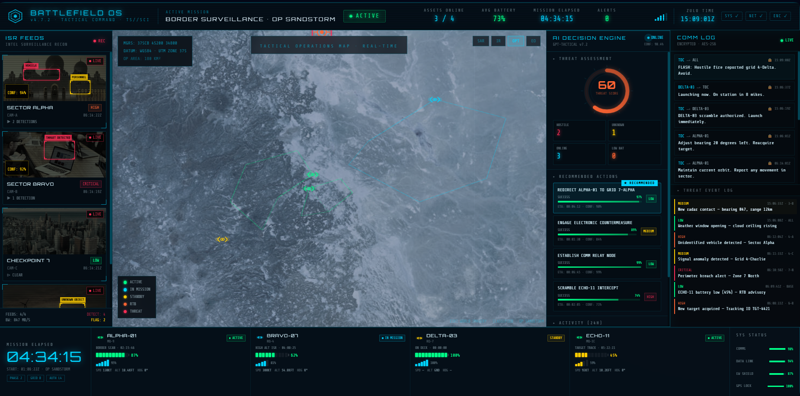

# BattlefieldOS

> Advanced Tactical Drone Command Interface
> Fictional next-generation battlefield operating system UI.


## Overview

BattlefieldOS is a futuristic battlefield management and drone command interface designed purely for visual experience and cinematic interaction.

This project simulates a military-grade tactical operating system with:

* Real-time drone telemetry
* Live battlefield monitoring
* Tactical radar systems
* Mission control panels
* Autonomous UAV tracking
* AI-assisted combat visualization
* Advanced command center aesthetics

⚠️ Important:
This project is **frontend-only** and uses completely dummy/mock data.
There is **no real backend**, no real drone communication, and no actual military functionality.

The main purpose of the project is:

* UI/UX experimentation
* futuristic dashboard design
* animation practice
* cinematic interface concepts
* creative frontend development

---

## Live Demo

🌐 Live Website:
https://battlefieldos.emiraslan3747.workers.dev

📦 GitHub Repository:
https://github.com/emiraslan37/BattlefieldOS

---

## Features

### Tactical Dashboard

* Interactive military-style interface
* Responsive control panels
* Real-time styled metrics

### Drone Monitoring

* Simulated UAV tracking
* Animated telemetry systems
* Dynamic mission states

### Radar & Map Systems

* Futuristic radar visuals
* Target scanning effects
* Mission overlays

### System Animations

* Smooth transitions
* HUD-inspired effects
* Neon/cyber military aesthetic

### Fully Frontend

* No backend
* No APIs
* No database
* Purely visual simulation

---

## Screenshots



## Installation

Clone the repository:

```bash
git clone https://github.com/emiraslan37/BattlefieldOS.git
```
---

## Project Philosophy

BattlefieldOS is inspired by:

* sci-fi military interfaces
* cinematic command centers
* drone operation systems
* cyberpunk HUD designs
* next-generation tactical software concepts

The goal was to create something that *looks* like a classified military operating system while remaining entirely fictional and safe.

---

## Disclaimer

This project is purely fictional and created for educational/design purposes only.

It does NOT:

* connect to real drones
* collect live data
* interact with military systems
* provide surveillance functionality

Everything shown in the interface is simulated.

---

## Future Ideas

* 3D globe integration
* AI voice assistant simulation
* Fake mission generation
* WebGL radar effects
* Multiplayer command simulation
* Advanced map rendering

---

## License

MIT License

---

## Author

Developed by Emir Aslan

GitHub:
https://github.com/emiraslan37

---

## Final Note

> “Not everything needs a backend to look dangerous.”

BattlefieldOS was built to feel like a classified tactical operating system from a sci-fi universe — even though underneath it’s just beautiful frontend engineering.
